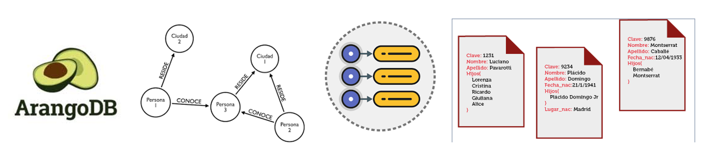

# El Cronista de Datos NoSQL

## 4.1. NoSQL vs. SQL  
Un modelo de documentos como **MongoDB** es más adecuado para el *Bestiario Digital* porque permite manejar estructuras de datos **dinámicas y heterogéneas** sin requerir un esquema fijo, como ocurre en las bases de datos relacionales.

En una base de datos relacional, todas las filas de una tabla deben tener las mismas columnas, lo que dificulta registrar criaturas con atributos muy distintos (por ejemplo, algunas con *alas* y otras con *escamas*).  
En cambio, en **MongoDB** cada documento puede tener su propio conjunto de campos, arreglos y objetos anidados, ofreciendo una **flexibilidad natural** para modelar información semi-estructurada.

Además, no es necesario modificar la estructura de la base cada vez que se agrega un nuevo tipo de criatura, facilitando la **evolución del modelo de datos** conforme crece el bestiario.

---

## 4.2. Tipos de NoSQL  
Otro tipo de base de datos NoSQL es **ArangoDB**, que se clasifica como **multimodelo**.  
Combina en un mismo motor los modelos **documental, de grafo y clave-valor**, permitiendo almacenar y consultar datos de diferentes formas sin necesidad de integrar varios sistemas.

A diferencia de MongoDB, que se enfoca únicamente en documentos, **ArangoDB** puede representar simultáneamente estructuras jerárquicas (documentos) y relaciones entre entidades (grafos), utilizando su lenguaje de consultas **AQL (Arango Query Language)**.

ArangoDB sería más útil que MongoDB en un *Bestiario Digital Extendido*, donde no solo se registren los datos de cada criatura, sino también sus **vínculos y jerarquías**.  
Por ejemplo, se podrían definir nodos para criaturas y aristas para representar relaciones como **“depredador de”**, **“sirviente de”** o **“descendiente de”**.  
De esta forma, ArangoDB consultaría tanto los atributos de cada criatura (como un documento) como sus conexiones con otras (como un grafo), ofreciendo una **visión más completa y relacional** del ecosistema.

---

## 4.3. Casos de Estudio  
Un caso real de uso de MongoDB es la plataforma de e-commerce **eBay**.  
Esta compañía adoptó MongoDB para manejar grandes volúmenes de datos semi-estructurados provenientes de catálogos de productos, comentarios de usuarios y registros de actividad.

MongoDB fue elegido por su **escalabilidad horizontal**, su capacidad para almacenar documentos con **estructuras variables**, y su **rendimiento óptimo** en operaciones de lectura y escritura distribuidas.

En escenarios donde los datos cambian constantemente y no siguen un formato uniforme —como los millones de publicaciones y transacciones de eBay—, MongoDB permite mantener un **rendimiento estable sin alterar esquemas ni realizar migraciones complejas**.

