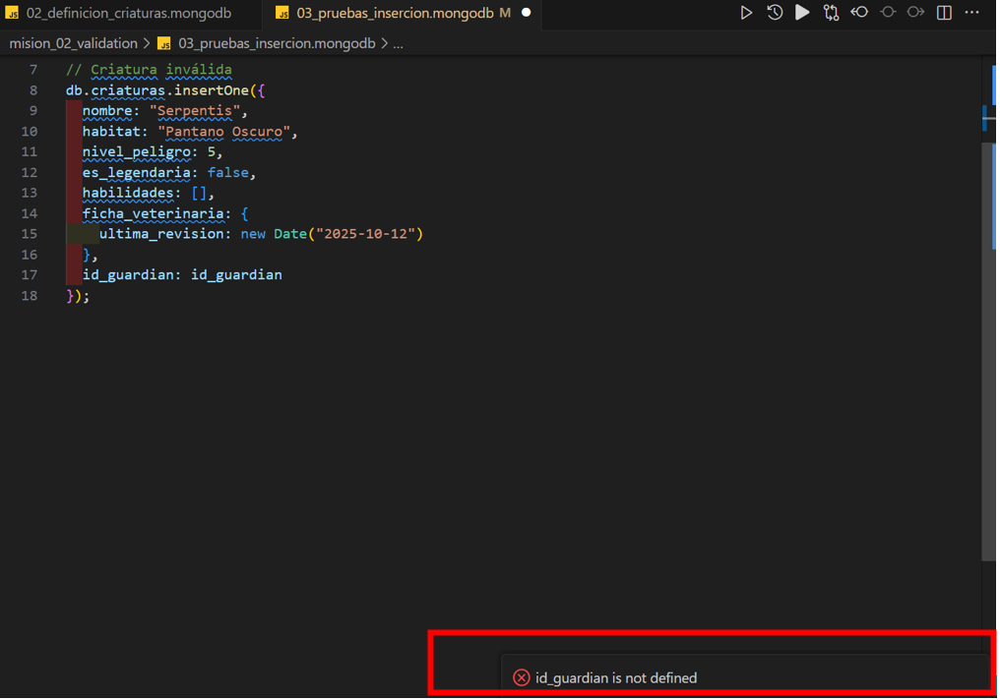

# Tarea 2 Individual: El Cronista de Datos NoSQL

**Autor:** Lara Anderson  
**Carrera:** Ingeniería en Tecnologías de la Información  
**Asignatura:** Modelado Avanzado de Base de Datos  
**Docente:** Ing. Paulo César Galarza Sánchez  
**Periodo:** Octubre 2025 – Mayo 2026  
**Fecha de Entrega:** 21/10/2025  
**Sede:** Universidad de las Fuerzas Armadas ESPE – Santo Domingo  

---

## Descripción del Escenario — *El Bestiario Digital*

El **Bestiario Digital** es un proyecto diseñado para explorar el uso de **bases de datos NoSQL**, específicamente **MongoDB**, en el manejo de información semi-estructurada.  
El propósito es crear un registro de criaturas fantásticas con atributos variados (como alas, escamas, poderes mágicos o múltiples cabezas), algo difícil de representar en modelos relacionales.

El proyecto se implementó en **MongoDB Atlas**, utilizando **Visual Studio Code** y la extensión oficial **MongoDB for VS Code**, que permitió la conexión directa al clúster en la nube y la ejecución del script mediante Playground.  
Durante el desarrollo se aplicaron los métodos **CRUD (Create, Read, Update, Delete)** para manipular los documentos de la colección principal `criaturas`.

---

## Instrucciones para ejecutar el script `misiones_mongodb.mongodb`

### Abrir el proyecto
- Abra **Visual Studio Code**.  
- Descargue o clone el repositorio desde GitHub.  
- Localice el archivo:  

---

### Instalar la extensión oficial de MongoDB
- En la barra lateral de VS Code, abra **Extensiones (Ctrl + Shift + X)**.  
- Busque e instale **“MongoDB for VS Code”** (desarrollada por MongoDB Inc.).  
- Asegúrese de tener una conexión activa (local o **MongoDB Atlas**).

---

### Conectarse a la base de datos
- En la barra lateral izquierda, abra la vista **MongoDB** (ícono de hoja verde).  
- Haga clic en **“Connect”** y seleccione:  
- *Local Connection* si usa MongoDB Community Server, o  
- *MongoDB Atlas Cluster* si usa la nube.  
- Una vez conectado, podrá ver las bases de datos existentes.  

---

### Ejecutar el script del Bestiario Digital
- Abra el archivo `misiones_mongodb.mongodb`.  
- En la esquina superior derecha, haga clic en **“Playground ▶️ Run All”**.  
- Esto ejecutará automáticamente todos los comandos definidos en el archivo:
- Creación de la base de datos `bestiario2`.  
- Creación de la colección `criaturas`.  
- Inserciones, consultas, actualizaciones y eliminaciones.

---

### Verificar los resultados
- En la vista **MongoDB** de VS Code, abra la colección:  
---

# Misión 2: El Guardián del Esquema y los Vínculos Arcanos

## Descripción General
En esta segunda misión del *Bestiario Digital*, actuamos como **Guardianes del Esquema** para proteger la base de datos de datos corruptos o inválidos.  
El objetivo fue implementar **reglas de validación estrictas** mediante **JSON Schema** y definir correctamente las **relaciones embebidas y referenciadas** entre las colecciones `guardianes` y `criaturas`.

Esta validación asegura la integridad de la información directamente en la base de datos, evitando inconsistencias aunque el backend o las inserciones externas omitan controles.

---

## Tecnologías Utilizadas
- **MongoDB** (consola integrada en VS Code)
- **Archivos `.mongodb`** para definición y pruebas
- **JSON Schema** para validación de documentos

---

## Estructura del Proyecto

mision_01_creacion/
│   ├── ANALISIS_NOSQL.md
│   └── misiones_mongodb.mongodb

mision_02_validation/
│   ├── 01_definicion_guardianes.mongodb (Crea la colección 'guardianes' con validaciones y esquema JSON)
│   ├── 02_definicion_criaturas.mongodb (Crea la colección 'criaturas' con validaciones y relaciones)
│   ├── 03_pruebas_insercion.mongodb (Inserciones válidas e inválidas para probar la integridad del esquema)
│   └── ANALISIS_VALIDACION.md
│
images/             (opcional para capturas o evidencias)
README.md          (principal del repo, si deseas enlazar las misiones)

---

## Detalle de Archivos

### `01_definicion_guardianes.mongodb`
Define la colección `guardianes` con validaciones sobre los campos:
- `nombre`, `rango`, `password_acceso`, `nivel`, `inventario`.
- Incluye una **relación 1-a-N embebida** con el inventario.

### `02_definicion_criaturas.mongodb`
Define la colección `criaturas` con validaciones sobre:
- `nombre`, `habitat`, `nivel_peligro`, `es_legendaria`, `habilidades`, `ficha_veterinaria`, `id_guardian`.
- Incluye una **relación 1-a-1 embebida** (ficha_veterinaria) y una **referencia 1-a-N** hacia `guardianes`.

### `03_pruebas_insercion.mongodb`
Contiene pruebas de inserciones válidas e inválidas para verificar la protección del esquema.
Se incluyen comentarios con los errores devueltos por MongoDB al fallar la validación.

  
**Figura 7.** Inserción válida en la colección **guardianes**, donde se cumple con todas las reglas de validación definidas en el JSON Schema (campos requeridos, tipos correctos y estructura del inventario).

  
**Figura 8.** Inserción inválida en la colección **guardianes**, donde el documento no supera las reglas de validación (por ejemplo, error en el patrón de contraseña o valor de rango incorrecto).

  
**Figura 9.** Inserción válida en la colección **criaturas**, demostrando la correcta aplicación de las relaciones embebidas (ficha_veterinaria) y referenciadas (id_guardian).

  
**Figura 10.** Inserción inválida en la colección **criaturas**, donde el documento no cumple con las reglas del JSON Schema (por ejemplo, falta el campo *salud* o el array *habilidades* está vacío).

### `ANALISIS_VALIDACION.md`
Documento de análisis que explica:
- Por qué validar en la base de datos.
- Justificación de relaciones embebidas y referenciadas.
- Decisiones de diseño del modelo.
